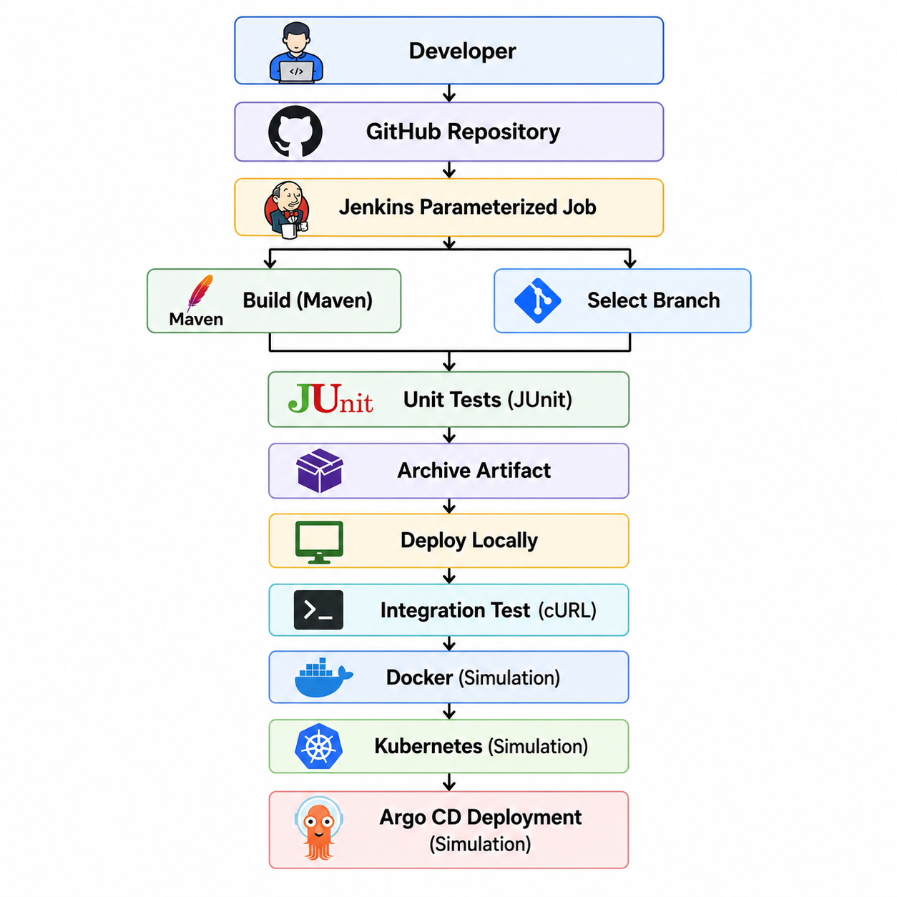

# Jenkins Parameterized Pipeline Job

## Overview

This project demonstrates a **parameterized CI/CD pipeline** built using **Jenkins** and integrated with **GitHub**. The pipeline automates software delivery by allowing users to select the Git branch and configure runtime parameters before execution.

The project showcases real-world DevOps practices including automated builds, testing, artifact archiving, local deployment, integration testing, and simulated containerization and Kubernetes deployment workflows.

---

## CI/CD Workflow

<p align="center">
  
</p>

---

## Build Parameters

| Parameter | Description |
|-----------|-------------|
| **BRANCH_NAME** | Select GitHub branch for pipeline execution |
| **SLEEP_TIME** | Controls delay before integration testing |
| **APP_PORT** | Defines application runtime port |

---

## Pipeline Overview

This project contains **two Jenkins pipelines**, each with a different purpose:

---

## 🟢 Main Branch Pipeline (Production Workflow)

The main branch pipeline is designed for a full CI/CD lifecycle simulation.

### Stages

1. **Build**
   - Displays selected parameters (branch, sleep time, port)
   - Executes Maven build (`mvn clean package -DskipTests=true`)
   - Archives generated JAR artifacts

2. **Test**
   - Runs unit tests using Maven
   - Publishes JUnit test reports

3. **Containerization (Simulated)**
   - Simulates Docker image build, tagging, and push steps

4. **Kubernetes Deployment (Simulated)**
   - Simulates deployment via Argo CD to Kubernetes cluster

5. **Integration Testing**
   - Waits using `SLEEP_TIME`
   - Simulates API validation using cURL commands

---

## 🟡 Test Branch Pipeline (Validation Workflow)

The test branch pipeline is used for development and verification purposes.

### Stages

1. **Maven Version Check**
   - Prints Maven version
   - Displays pipeline parameters

2. **Build**
   - Builds application using Maven
   - Archives JAR artifact

3. **Test**
   - Executes unit tests
   - Publishes JUnit reports

4. **Local Deployment**
   - Runs application locally using:
     ```
     java -jar target/hello-demo-*.jar
     ```

5. **Integration Testing**
   - Waits using `SLEEP_TIME`
   - Sends request to:
     ```
     http://localhost:${APP_PORT}/hello
     ```

---

## Features

- Parameterized Jenkins Pipeline
- GitHub Branch-based Execution
- Maven Build Automation
- JUnit Testing Integration
- Artifact Archiving
- Local Deployment Support
- Integration Testing using cURL
- Docker Workflow Simulation
- Kubernetes Deployment Simulation
- Argo CD Deployment Simulation

---

## Branch Strategy

| Branch | Purpose |
|--------|--------|
| **main** | Full CI/CD production-style pipeline |
| **test** | Development and validation pipeline |

---

## Technologies Used

- Jenkins
- GitHub
- Apache Maven
- Java
- JUnit
- Docker (Simulation)
- Kubernetes (Simulation)
- Argo CD (Simulation)

---

## Learning Outcomes

This project demonstrates practical understanding of:

- CI/CD pipeline design and automation
- Jenkins Declarative Pipelines
- Parameterized Builds
- Branch-based deployment strategies
- Maven build lifecycle
- Automated unit testing with JUnit
- Artifact management in CI/CD
- Deployment pipeline simulation
- DevOps workflow orchestration

---